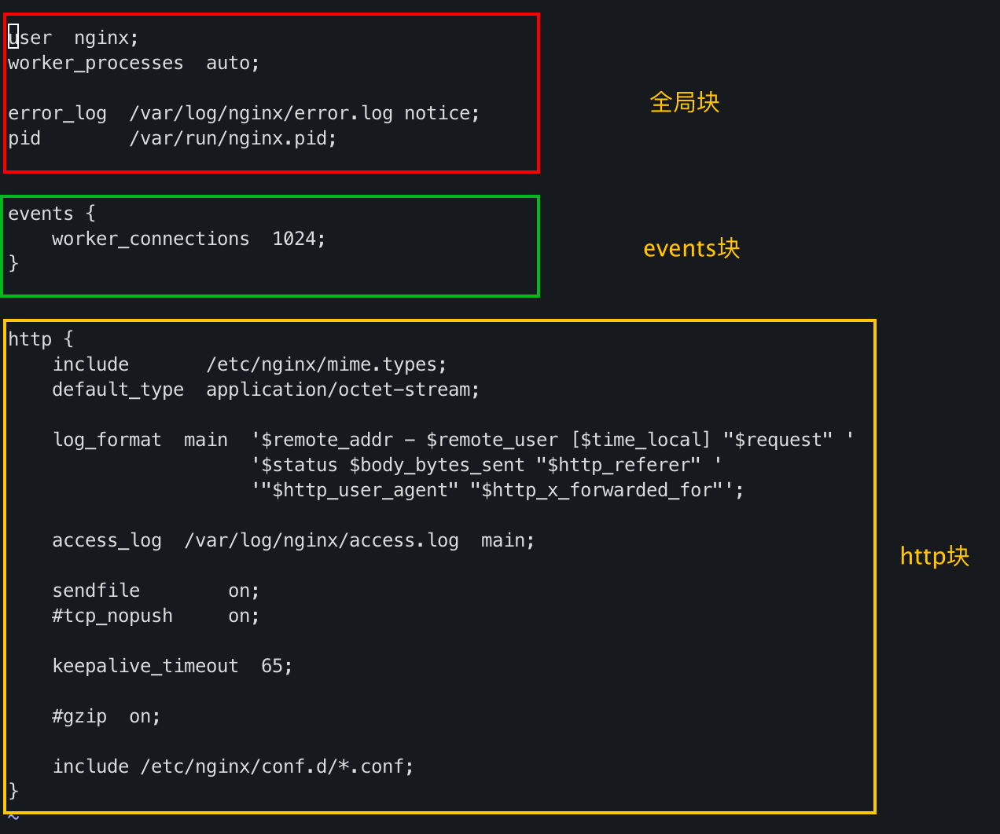

1.nginx配置文件由三部分组成

(1)全局块- 
从配置文件开始到events块之间的内容,主要设置一些影响nginx服务器整体运行的配置指令

● user username
指定用于运行worker进程的用户,默认和在编译nginx是指定--user参数有关

● worker processes auto
可以根据物理CPU自动设定,也可以设置具体数值 数值越大 可以支持的并发处理量也越多

● error_log logs/error.log  info;
错误日志文件及级别

● pid logs/nginx.pid;
指定nginx进程的PID文件路径

● worker_rlimit_nofile 65535;
指定每个worker进程能打开的最大文件描述符数量

(2)events块
主要影响nginx服务器和用户的网络连接
● worker_connections 1024;
每个worker进程所能够响应的最大并发请求数量

● use [epoll | rgsig | select | poll]]
定义使用的事件模型，建议用epoll

(3)http块
配置最频繁的部分 也可以包括 http/server块

● include path/to/file
包含其他扩展配置文件

● default_typeapplication/octet-stream;
响应类型

● log_format main ....
定义日志名字以及日格式化

● access_log logs/access.log  main;
定义日志文件路径,格式

● sendfile on|off
启用sendfile功能,静态文件直接在内核中封装响应,而不是从内核空间到用户空间封装后,再发往内核空间.

● tcp_nopush on|off
仅在sendfile为on时有用, 其功能:尝试将多个报文首部压缩成一个发送

● tcp_nodelay on|off
对keepalive模式下的连接是否使用tcp_nodelay选项,默认关闭.其功能为:把多个小报文合并为一个报文,一起发送. 此机制可以提高带宽利用率,将发往同一个主机很小的TCP报文合并成一个,实际生产对于用户请求即使浪费带宽也不能合并请求

● keepalive_timeout 65;
设置keepalive连接的超时时长,0表示禁止长连接，默认65s

● gzip on|off
启用或禁用gzip压缩响应报文

● gzip_buffers number size;
default 32位系统4k,64位系统8k

● gzip_comp_level LEVEL;
压缩比,1-9,默认为1

● gzip_disable regex ...;
regex是为用于匹配客户端响应器类型的正则表达式,表示对何种浏览器禁止使用压缩功能

● gzip_min_length LENGTH;
触发压缩功能的响应报文的最小长度

● gzip_http_version 1.0 | 1.1;
设定启用压缩功能的最小版本

● gzip_proxied off | expired | no-cache | no-store | private | no_last_modified | no_etg | auth | any ...;
定义对客户端请求的具有何种请求属性的资源启用压缩功能,如expired表示:对由于使用expire首部而无法缓存的对象启用压缩功能

● gzip_types mime.type;
指明对那些类型的资源进行压缩

● server {}
定义一个虚拟主机

● listen 80;
监听地址

● server_name
主机名

● charset
字符集编码

●  location [ = | ~ | ~* | ^~ ] url { ...}
= : URI的精确匹配
~ : 做正则表达式匹配,区分字符大小写
~* : 做正则表达式匹配,不区分字符大小写
^~ : URI的左半部分匹配,不区分字符大小写
允许根据用户请求的URI来匹配定义的各location,匹配到时, 此请求将被相应的location块中的配置所处理, 用于为需要用到专用配置的uri提供特定配置.
当匹配多次时,其匹配优先级为:精确匹配=,^~,~或~*,不带符号的URL, 如果优先级都一样, 就匹配最精确的规则

● root
设置html文件资源的路径

● index
设置默认主页

● alias
定义文件别名
