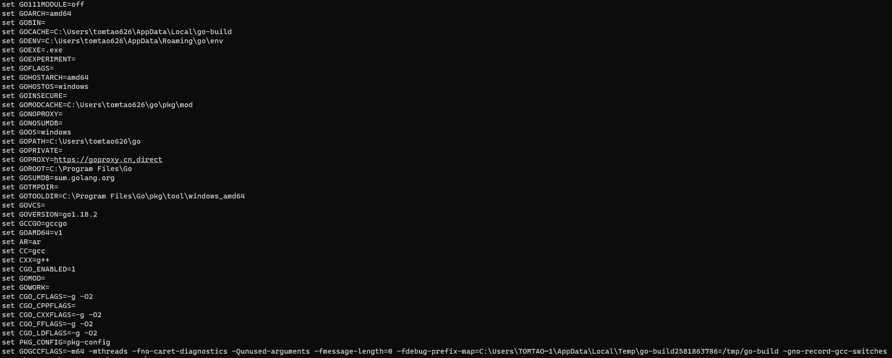
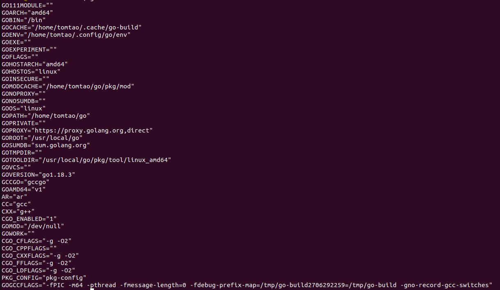

# 1 支持平台

> + FreeBSD
> + Linux
> + Mac OS X
> + Windows

# 2 安装包下载

| 系统平台OS   | 版本     | Arch                | 下载链接                                            |
|----------|--------|---------------------|-------------------------------------------------|
| FreeBSD  | 1.18.3 | x86-64              | https://go.dev/dl/go1.18.3.freebsd-amd64.tar.gz |
| Linux    | 1.18.3 | x86-64              | https://go.dev/dl/go1.18.3.linux-amd64.tar.gz   |
| Mac OS X | 1.18.3 | x86-64(intel/apple) | https://go.dev/dl/go1.18.3.darwin-amd64.pkg     |
| Windows  | 1.18.3 | x86-64              | https://go.dev/dl/go1.18.3.windows-amd64.msi    |

# 3 安装

## 3.1 Linux/FreeBSD 安装 (也适用于Mac OS X 平台)

### 3.1.1 下载

```bash
$ wget https://go.dev/dl/go1.18.3.linux-amd64.tar.gz
```

## 3.1.2 解压安装(可能需要在root权限下运行)

```bash
$ rm -rf /usr/local/go && tar -C /usr/local -xzf go1.18.3.linux-amd64.tar.gz
```

## 3.1.3 配置环境变量

> + 添加 `/usr/local/go/bin` 到 `path`环境变量

```bash
$ vim $HOME/.profile # vim /etc/profile 亦可
$ export PATH=$PATH:/usr/local/go/bin
```

## 3.1.4 测试

```bash
$ go version
# 出现如下内容说明golang安装成功
# go version go1.18.2 linux/amd64
```

## 3.2 Mac OS X 安装

### 3.2.1 下载/安装

> + 下载golang pkg安装包，双击安装即可，同时安装程序会将`/usr/local/go/bin`自动添加到`path`环境变量里。

### 3.2.2 测试

```bash
$ go version
# 出现如下内容说明golang安装成功
# go version go1.18.2 darwin/amd64
```

## 3.3 Windows 安装

### 3.2.1 下载/安装

> + 下载golang msi安装包，双击安装即可。
> + 可以将 golang 的安装`bin`目录添加到 `Path` 环境变量中。添加后你需要重启命令窗口才能生效。

### 3.2.2 测试

```bash
$ go version
# 出现如下内容说明golang安装成功
# go version go1.18.3 windows/amd64
```

# 4 运行程序

## 4.1 创建go程序目录(适用于Unix平台,win下可手动创建)

```bash
mkdir go_workspace
cd go_workspace
vim go_test.go
```

## 4.2 编写第一个go程序

> + 输入以下代码:

```go
package main

import "fmt"

func main() {
	fmt.Println("Hello, World!")
}
```

## 4.3 编译&运行go程序

```bash
go build main.go
# 在当前目录下会输出名为main的可执行文件，执行可执行文件也可以输出同样的结果
# ./main.exe(win)
# ./main(Unix)
# Hello, World!
```

> + 使用 go 命令执行以上代码输出结果如下：

```bash
go run go_test.go
# Hello, World!
```

# 5 golang国内镜像配置

## 5.1 查看已安装的go环境参数

```bash
go env
```

> + Windows
>   + 

> + Linux
>   + 

## 5.2 GOPROXY代理

> + 其中的`GOPROXY`对应镜像,首先设置为国内镜像

```bash
go env -w GOPROXY=https://goproxy.cn,direct
go env -w GOSUMDB=off   #（关闭包的有效性验证）
go env -w GOSUMDB="sum.golang.google.cn"  #（也可设置国内提供的sum 验证服务）
```

备注：-w 标记 要求一个或多个形式为 NAME=VALUE 的参数且覆盖默认的设置

## 5.3 包管理

> + 为避免`GOPATH`的问题设置`GO111MODULE=on`

```bash
go env -w GO111MODULE=on
```

### 5.3.1 Go Modules 的使用说明
#### 使用 go get 同样会更新你的 go.mod

`go get` 通常它是用于提供一个安装或下载包的功能。但如果使用了 `Go modules`，当你在一个有着 go.mod 文件存在的仓库下使用这个命令会将你所下载或安装的包静默记录于 `go.mod` 文件中。

#### Go Modules 依赖项的存储在哪个目录？

使用 `Go Modules` 时，在 `go build` 期间使用的包存储在 `$GOPATH/pkg/mod` 中。

> + 在尝试在开发工具中的import时，你可能最终使用的包是 `GOPATH` 中的版本，而不是编译期间使用的 `pkg/mod`。

当让项目固定指向一个依赖项时，可以使用 `vendor` 目录

> + 解决方法 1: 使用 `go mod vendor` + `go build -mod=vendor`。这将强制 go 使用 `vendor/files` 而不是 `$GOPATH/pkg/mod` 中的一个。该选项还解决了 开发工具 不能打开包文件的正确版本的问题。
> + 解决方法 2: 在 `go.mod` 末尾添加 `replace` 行:

```bash
use replace github.com/maelvls/beers => ../beers
```

# 6 开发工具

golang开发的IDE无外乎以下两种:

> + Goland (付费)
> + vscode + go plugins (白嫖)

看个人使用习惯，我这里推荐goland，上手更快，更加友好。